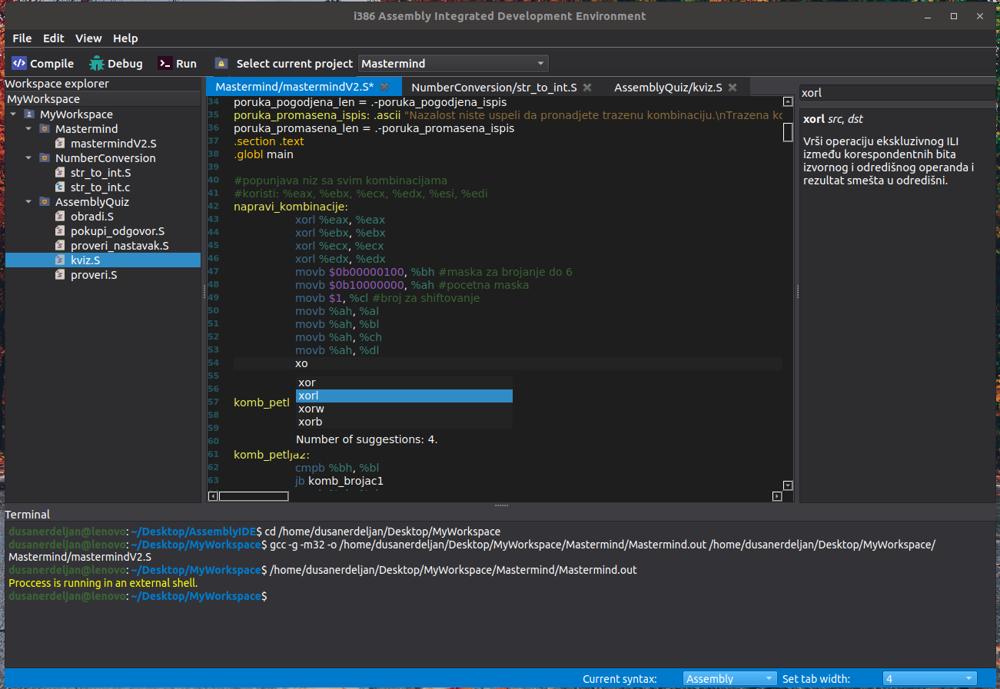

# i386ide

Integrated development environment for i386 assembly and C programming language for Linux in development.

## System requirements  

This program is built for Linux operating system (Ubuntu 16.04 or higher) and requires ***gcc **compiler (and gcc-multilib if you are using 64-bit operating system)***** and
***ddd (Data Display Debugger)*** to be installed.

## Running the program from the source code

To run this program from the source code you need **Python 3.6 or higher** and you have to install **PySide2** library. Run command is *python3 main.py*.

## Download executable file
[i386ide v1.0.0 for Ubuntu 18.04 or newer](https://drive.google.com/file/d/1Z7bS9fTf1BKzwe0CxKGKaJdArIC95riq/view?usp=sharing)

## Installation

Download [shell scipts](https://drive.google.com/file/d/1MgTbTgGpr16GuK1IJCpvoz_XHTS4MuH8/view?usp=sharing). 
Download executable file, extract it and copy & paste install.sh in the extracted directory.  Position yourself in the extracted folder and run ***sudo bash install.sh*** to install the program. This will create a desktop entry. </bre>If you want to uninstall the program, run ***sudo bash uninstall.sh*** from any location.
 
## Credits

All the icons in our program are downloaded from https://remixicon.com/.

## License

This program is free. 
You can redistribute it and/or change it under the terms of **GNU General Public License version 3.0** (GPLv3).  
You can find a copy of the license in the repository.
